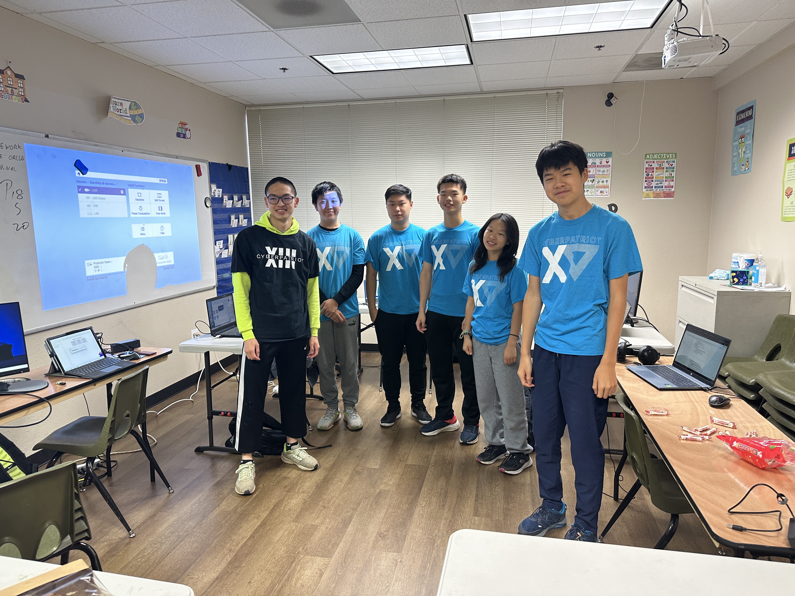
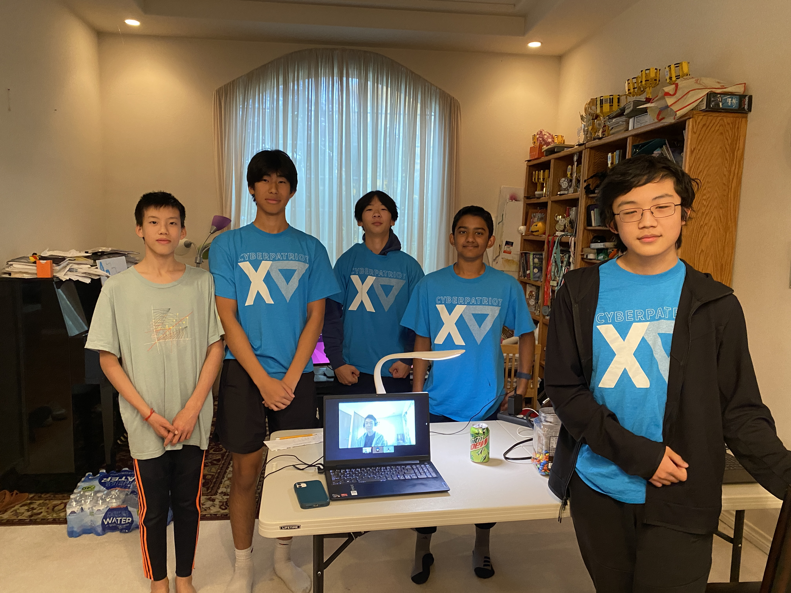
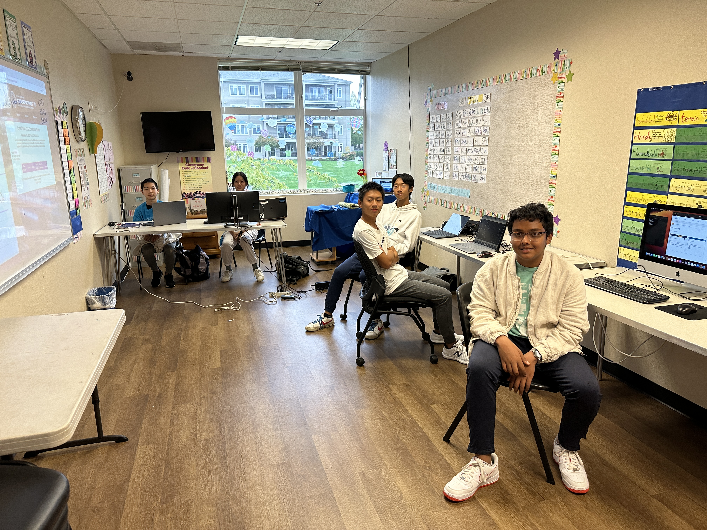
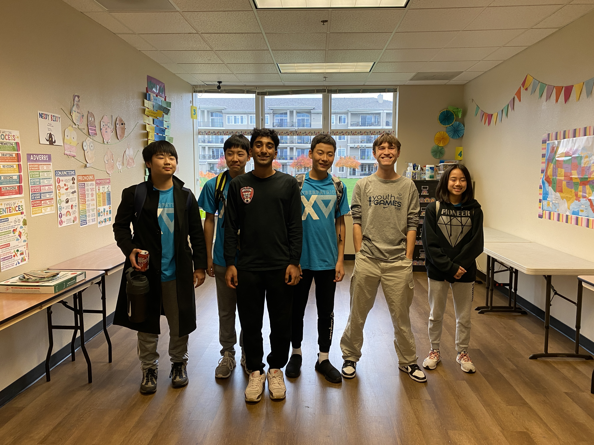
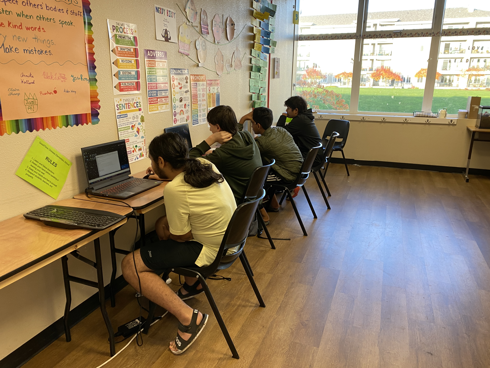

## [Home](./index.html) | [Apply](./apply.html) | [CyberCamp](./cybercamp.html) | [Blog](./blog.html) | [Contacts](./contacts.html) | [Resources](./resources.html) | [Tech Caregiver](./techcg.html) | [Events](./events.html)

## The combined score from Rounds 1 and 2 will determine the tier placement of 5000+ Cybersecurity teams in the different Tiers:
- Platinum - Top 25% or top in state
- Gold - Next 25% or top in state in this tier
- Silver - Rest of Teams
There were

## Team 1 Titanturtles
Ranked \#6 US/Canada \#1 Oregon Platinum Tier

## Team 2 Titantortoises
Ranked \#27 US/Canada \#2 Oregon Platinum Tier

## Team 3 Titantortugas
Ranked \#63 US/Canada \#4 Oregon Platinum Tier

## Team 4 Titanwugui
Ranked \#645 US/Canada \#9 Oregon Platinum Tier

## Team 5 Titantortue
Ranked \#1332 US/Canada \#11 Oregon Gold Tier

