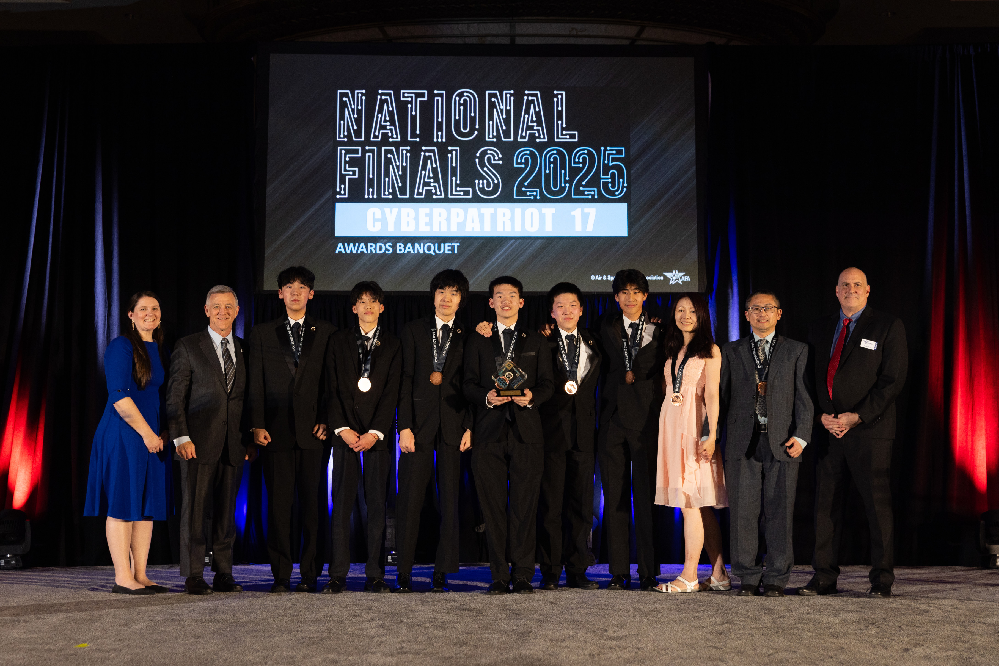
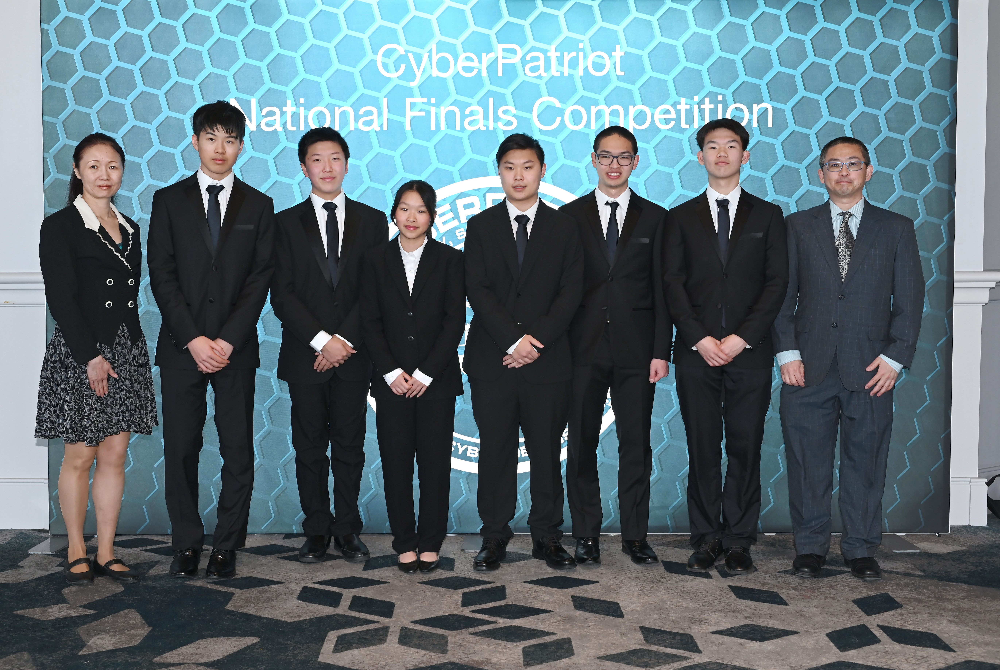
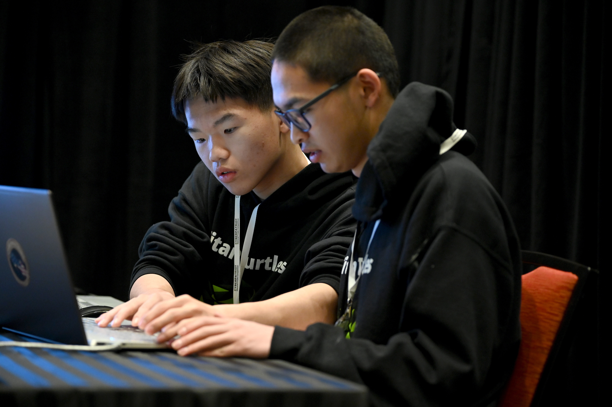
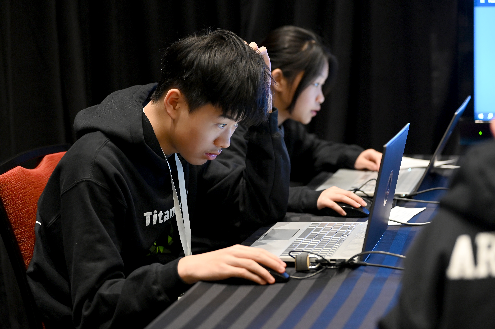
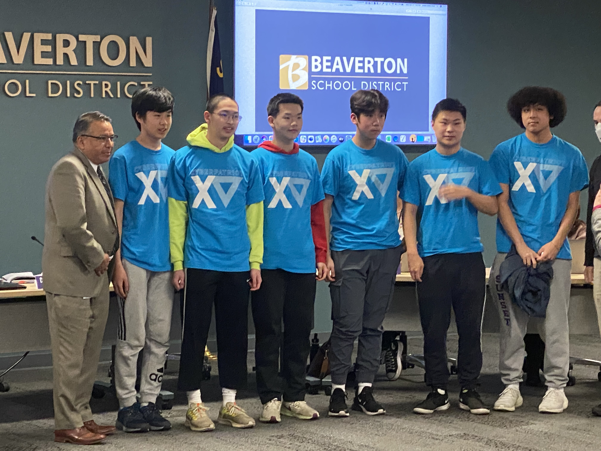
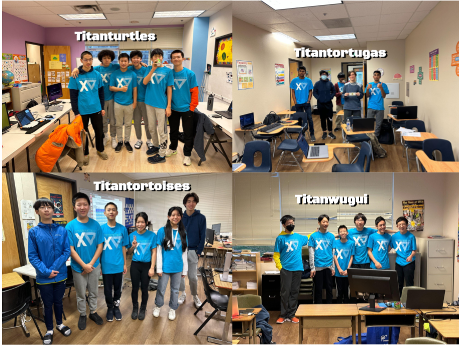

## [Root](./index.html) | [Join](./apply.html) | [Camp](./cybercamp.html) | **Blog** | [Touch](./contacts.html) | [Grind](./resources.html) | [Caregiver](./techcg.html) | [Events](./events.html) | [Legend](./legend.html)

# TitanTurtles 2025-2026 CyberPatriot 18 season Round 1

(18-0035) TitanTurtles placed 7th in the Nation and 1st in the state.

(18-0022) TitanTortoises placed 35th in the Nation and 2nd in the state.

(18-0024) TitanWugui placed 60th in the Nation and 3rd in the state.

(18-0026) TitanTortugas placed 142nd in the Nation and 4th in the state.

(18-0036) TitanTartarugas placed 313th in the Nation and 5th in the state.

# TitanTurtles 2024-2025 National Finals Competition in MD (Mar. 15-17)

Congratulations TitanTurtles for becoming the first Oregon team to reach the podium at the CyberPatriot National Finals! The team worked really hard the day before the network security master challenge and it was worth it. Time to prepare for next year's nationals!\

_3rd - CyberPatriot 17 National Finals_

# TitanTurtles 2024-2025 Round 4 (Semifinals Round) competition January 23-25

Semifinals Results:
* Team 17-0224 TitanTurtles Qualified for the National Finals! - National rank #2\
  This is Team TitanTurtles and the TitanTurtles club's second year advancing to the National Finals in CyberPatriot. Perhaps the only Oregon team to ever reach the top 3 in the Semifinals round.
* Team 17-0219 TitanTortugas Ranked #37 in the Nation\
* Team 17-0221 TitanWugui Ranked #114 in the Nation\

Very Well Done teams!

# TitanTurtles 2024-2025 Round 3 (State round) competition December 12-15
Team 17-0224 TitanTurtles team competed first this round at coach's house on Friday night after school. Most students had just finished full-day school and were exhausted. There were a few glitches through the process too. Cisco quiz was opened first without informing rest of the team. Team's overall ranking is #2 in the nation as of Sunday morning. CyberAegis will start competing on Sunday and knock down the ranking of every team on leader board.

Team 17-0219 TitanTortugas competed on Saturday afternoon at coach's house. Linux image crashed twice due to incorrect PAM configurations. Lots to learn during winter break.

Team 17-0221 TitanWugui competed on Sunday morning. Coach, mentor and teammates are all in high spirit prior to competition.

Team 17-0228 TitanTortue competed on Sunday afternoon. Cisco main was sick. Mohan was appointed Cisco main on spot and working on his best to carry Networking.

# TitanTurtles 2024-2025 Round 2 competition final results

# TitanTurtles 2024-2025 Round 2 Competition (November 14-17)
Team 17-0224 TitanTurtles hype men prior to the competition

Team 17-0219 TitanTortoises very serious prior to the competition

Team 17-0221 TitanWugui composed of all rookie teammates. Griffin works on Cisco this year. Club President Arthur Yang cheered up the wholte team

Team 17-0228 TitanTortue well prepared for the challenges

# TitanTurtles 2024-2025 Competition Started
Round 1 Results: All four teams full scored

Our team hoodies this year are admirable

Team 17-0224 TitanTurtles: Kevin Du, Arthur Yang, John Kong, Ashton Jiang, Brian Yu, Sean Ji

Team 17-0219 TitanTortoises: Joseph Liang, Owin Yin, Derek Zhao, Luke Zhang, Jerry Zhong, Chelsea Teh

Team 17-0228 TitanTortue: Sarah Hu, Chris Hu, Hanah Ho, Mohan Gupta, Luke Xie, Kyler Chen 

Team 17-0221 TitanWugui: Ian Hall, Shengxi Chen

# 4th Place Overall CyberPatriot National Finals!!!
Team Photo:

Cisco Team:

Linux Team:

Windows Team:

## National Finals Interview:
<iframe width="560" height="315" src="https://www.youtube.com/embed/6Erlyzl-_zQ" title="National Finals Interview" frameborder="0" allow="accelerometer; autoplay; clipboard-write; encrypted-media; gyroscope; picture-in-picture; web-share" allowfullscreen></iframe>

# 5th Place CyberPatriot XVI SemiFinals

Team Roster:
- Arnold Yang: Senior - Team Captain and President of Linux Systems
  - National Rank: 2nd Place Debian 11, 1st Place Boeing CyberPhysical Systems, 1st Place Web-Based Challenge
- Michael Xu: Senior - President of Cisco Networking
  - National Rank: 2nd Place Cisco Networking
- Sean Ji: Sophomore - President of Windows Systems
  - National Rank: 6th Place Windows Server 2022
- Arthur Yang: Freshman - Vice President of Linux Systems
  - National Rank: 5th place Ubuntu 22
- Ashton Jiang: Sophomore - Vice President of Cisco Networking
  - National Rank:  2nd Place Cisco Networking
- Anya Li: Junior - Vice President of Windows Systems
  - National Rank: 28th place Windows 10
 
Congratulations Team TitanTurtles, for being the first Oregon team to advance to the National Finals in CyberPatriot! The only team to do it!

Official Published Results: [https://www.uscyberpatriot.org/Documents/Scores/CP16%20National%20Finalists\_Published.pdf](https://www.uscyberpatriot.org/Documents/Scores/CP16%20National%20Finalists_Published.pdf)

## 2023-2024 Season
[Rounds 1 and 2 Competition Results](./2324round12results.html)

## Recognition of Titanturtles Team at BSD Board Meeting

<iframe width="560" height="315" src="https://www.youtube.com/embed/QEbpzIMqRUA" title="YouTube video player" frameborder="0" allow="accelerometer; autoplay; clipboard-write; encrypted-media; gyroscope; picture-in-picture; web-share" allowfullscreen></iframe>

## SEMIFINAL COMPETITION JANUARY 21, 2023

## COMPETITIONS

Semifinals Awards:

State Round Awards for CyberPatriot Competition:

**Team 15-1766 TitanTurtles Roster (Global Platinum Tier #17, OR #1)**
 - Arnold Yang: 11th Grade              Westview High School              President: Westview CyberSecurity Club
 - Michael Xu: 11th Grade               Westview High School              Chief Networking Officer: Westview CyberSecurity Club
 - Sean Ji: 9th Grade                   Oregon Episcopal School           Vice President Windows: Team TitanTurtles
 - Kevin Yu: 11th Grade                 Sunset High School                Vice President Networking: Team TitanTurtles
 - Arthur Yang: 8th Grade               International School of Beaverton Vice President Linux System: Team TitanTurtles
 - Kevin Du: 9th Grade                  Catlin Gable                      Vice President Windows Server: Team TitanTurtles

**Team 15-1767 TitanTortoises Roster: (Global Platinum Tier #109, OR #3)**
 - Jerry Zhong: 9th Grade                  Westview High School              Vice President of Windows: Team TitanTortoises
 - Anya Li: 10th Grade                     International School of Beaverton Team Captain: Team TitanTortoises
 - Derek Zhao: 8th Grade                   Willamette Valley Academy         Vice President of Windows Server: Team TitanTortoises
 - Mandy Chang: 7th Grade                  Shahala Middle School             Vice President of Linux System: Team TitanTortoises
 - Nathan Chen: 11th Grade                 Camas High School                 Vice President of Linux Ubuntu: Team TitanTortoises
 - Ashton Jiang: 9th Grade                 Columbia River High School        Vice President of Cisco Networking: Team TitanTortoises

**Team 15-1769 TitanWugui Roster: (Global Platinum Tier #146, OR #4)**
 - Ethan Knapp: 9th Grade                 Westview High School              Vice President of Linux System: Team TitanWugui
 - Michael Fu: 9th Grade                  Sunset High School                Team Captain: Team TitanWugui
 - Yedong Yu: 8th Grade                   Stoller Middle School             Vice President of Linux System: Team TitanWugui
 - John Kong: 7th Grade                   Willamette Valley Academy         Chief Networking Officer: Team TitanWugui
 - Devin Chen: 9th Grade                  Lake Oswego High School           Vice President of Networking: Team TitanWugui
 - Luke Zhang: 9th Grade                  Lincoln High School               Vice President of Windows Server: Team TitanWugui

 **Team 15-1768 TitanTortugas Roster: (Global Platinum Tier #156, OR #5)**
 - Ammar Mukadam: 11th Grade                   Westview High School                         Co-Captain: Team TitanTortugas
 - Owen Gifford: 11th Grade                    Westview High School                         Co-Captain: Team TitanTortugas
 - Virinchi Vanjarapu: 11th Grade              Westview High School                         Chief Networking Officer: Team TitanTortugas
 - Issac Loo: 11th Grade                       Westview High School                         Vice President Networking: Team TitanTortugas
 - Siddesh Mangipudi: 12th Grade               Westview High School                         Vice President Windows: Team TitanTortugas
 - Yuma Endo: 9th Grade                        Westview High School                         Vice President Linux: Team TitanTortugas

 **Team 15-1839 TitanKacchuas Roster: (Global Gold Tier #482, OR #1)**
 - Taafeef Khayer: 8th Grade                  Tumwater Middle School                        Captain: Team TitanKacchuas
 - Meet Raval: 11th Grade                     Westview High School

Titanturtles Club organized five teams to participate in 2022-2023 US Cyber Patriot competition:

15-1766 Titanturtles

15-1767 Titantortoises

15-1769 Titanwugui

15-1768 Titantortugas

15-1839 Titankachhuas

### CYBERPATRIOT 2022-2023 ROUND 4 (SEMIFINAL ROUND) COMPETITION: JAN 21, 2023
The semifinal round is what determines whether, the teams make Nationals. Although, the images have various predetermined rankings, all were super hard, only Ubuntu was hard, we can gain a more accurate understanding of the image difficulty by looking at the public scores. Fedora in this case was Extremely hard, as 99% of teams got less than 10 points on it. Ubuntu although now only marked hard, was harder than the State Round Ubuntu which was marked superhard. Windows and Windows Server were relatively easier and was where all the points were got. The Boeing Challenge were points that team's must obtain, the web challenge had one super hard part and a relatively easier part. The Cisco Networking Quiz was easy, but the packet tracer was super hard.

### CYBER PATRIOT 2022-2023 ROUND 3 (STATE ROUND) COMPETITION: DEC 10-11, 2022

State Round competition is at a premium level. Windows 10 images is medium. Windows Server 2019 image is hard. Ubuntu 20 is super hard. Team 15-1766 Titanturtles scored 271 total score, harvested Oregon first place champion in High School Open Division Platinum Tier and ranked #17 out of 630 High School Open Division Platinum Tier teams all over the world.

### CYBER PATRIOT 2022-2023 ROUND 2 COMPETITION: NOV 5-6, 2022

Four of five teams improved their High School Open Division Ranking in Round 2 and advanced to Platinum Tier of next round of competition.. Team 15-1839 Titankachhuas will compete within Gold Tier in Round 3

### CYBER PATRIOT 2022-2023 ROUND 1 COMPETITION: OCT 20-22, 2022

All five teams achieved outstanding results during round 1. Team 15-1766 Titanturtles scored perfect scores on Windows 10, Windows Server 19, Ubuntu images and scored 28.86 out of 30 on Cisco networking. Titanturtles team ranked #1 in Oregon and #19 out of 2,092 teams in High School Open Division.

Team members of 15-1766:

Arnold Yang (Team Captain)

Arthur Yang (Vice President of Linux Operating System)

Sean Ji (Vice President of Windows system)

Kevin Du (Vice President of Windows Server)

Michael Xu (Chief Networking Officer)

Kevin Yu (Vice President of Cisco Networking)

